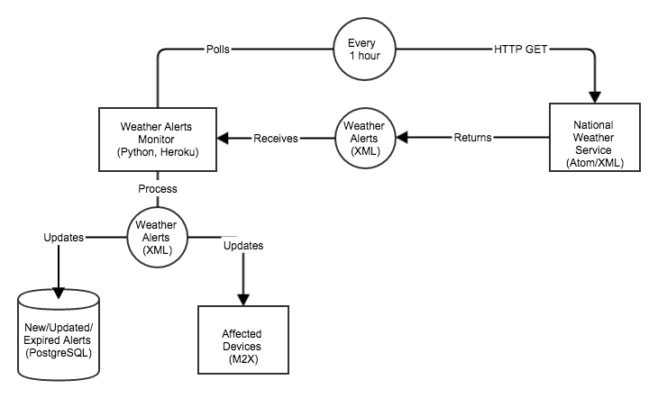

# National Weather Service Alerts to M2X


This application checks for new weather alerts from the [National Weather Service](http://www.weather.gov/) and updates affected [M2X](https://m2x.att.com) devices by sending a [Command](https://m2x.att.com/developer/documentation/v2/commands) to the devices and also by updating streams on the device which provide a time-series log of the weather alert status, message & url.

To view the raw NWS RSS feed: http://alerts.weather.gov/cap/us.php?x=0

## Architecture



## Pre-Requisites

### You will need to have an account on the following services:

1. [M2X](https://m2x.att.com/signup): M2X is an IoT time-series data storage & device management service. The M2X developer tier account is free for up to 10 devices @ 100,000 max data points written per device/month. Should you desire more capacity you'll need to [upgrade your M2X Account](https://m2x.att.com/pricing).
2. [Heroku](https://www.heroku.com/): Heroku is a PaaS that enables developers to build and run applications entirely in the cloud.

### FIPS6 & UGC Location Codes

The National Weather Service classifies the location of weather alerts by [FIPS6 county code](https://en.wikipedia.org/wiki/FIPS_county_code) and/or [Universal Geographic Code](http://www.nws.noaa.gov/emwin/winugc.htm).

This application determines if an M2X device is affected by the weather alert based on the FIPS6 and UGC codes which should be stored in the device's metadata under keys `fips6` and `ugc` respectively.

If you'd like FIPS6 & UGC codes to automatically update on your devices whenever the device updates it's location in M2X check out the [nws-geo-m2x](https://github.com/kristinpeterson/nws-geo-m2x) sample app.

## Installation

### Deploying your application

Click the Heroku button to deploy your application to Heroku:

[](https://heroku.com/deploy)

### Setup Config Variables in Heroku

#### Via Heroku CLI
(requires [Heroku Toolbelt](https://toolbelt.heroku.com/))

M2X Master API Key:
```
heroku config:set M2X_API_KEY={YOUR-M2X-MASTER-API-KEY}
```

#### Via Heroku Dashboard

You can also [edit config vars](https://devcenter.heroku.com/articles/config-vars#setting-up-config-vars-for-a-deployed-application) on your app’s settings tab on your Heroku Dashboard.

### Configure Heroku Scheduler

This app employs a worker script which you will configure to run hourly using the Heroku Scheduler add-on. To configure, head to the Heroku Dashboard for the app and add the following job via the [Heroku Scheduler add-on](https://devcenter.heroku.com/articles/scheduler#scheduling-jobs):

```
python nws-alerts-m2x/worker.py
```

**Important Note:** the Heroku Scheduler has an option for running jobs at a frequency of `Every 10 Minutes`, `Hourly` or `Daily`. This script can run longer than 10 minutes depending on the number of new alerts and/or how many devices are being updated - thus you should choose a frequency of either `Hourly` or `Daily`, otherwise the script may be interrupted.

## Issues

Feel free to report any issues you encounter with this app via GitHub

## Thanks to...
* [M2X](https://m2x.att.com): time-series data store
* [Heroku](https://www.heroku.com): cloud application hosting
* [NWS Alerts](http://alerts.weather.gov): National Weather Service alerts RSS feed

## LICENSE

This sample application is released under the MIT license. See [`LICENSE`](LICENSE) for the terms.
